<!-- <h1 align="center">
  
</h1>

  

 -->

<!-- -->

<!-- ## ABOUT ME: 

#### The only thing you should know is that I'm always curious to learn the latest in technology. A bit of a cross-platform application development enthusiast.   

⭐️ Profile [@zKXDEX](https://github.com/zKXDEX) -->

# 

# @KDex

Software engineer, full stack developer, and a passionate about the latest in technology.

